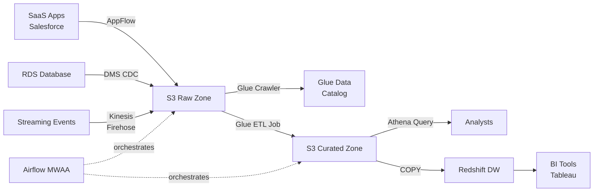
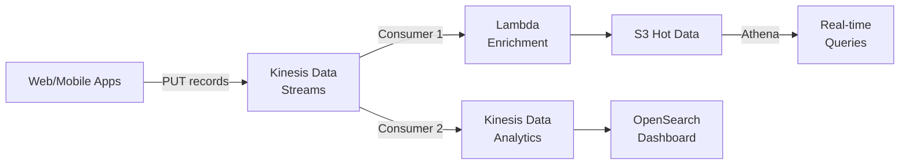
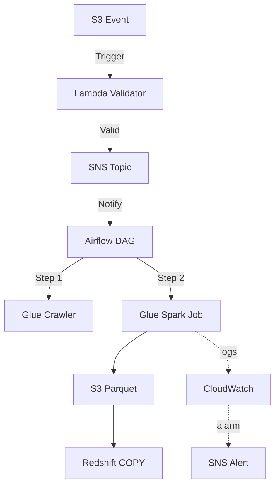
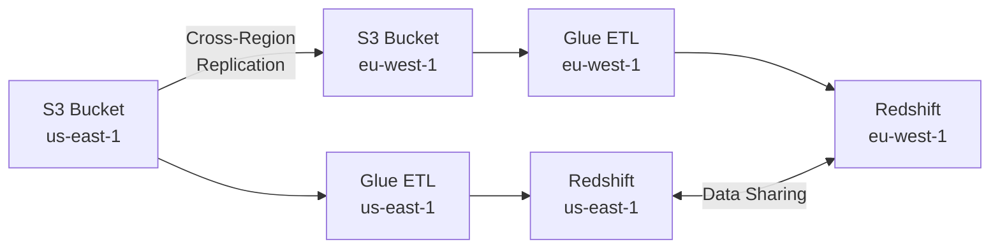
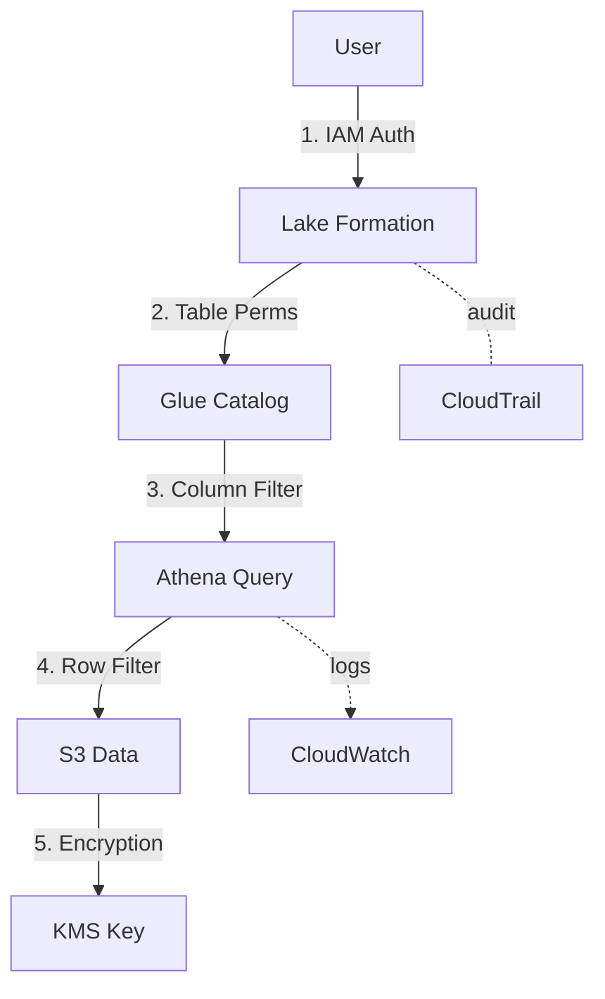
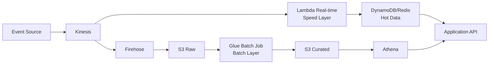

# AWS Data Engineering: The Complete Guide 🚀

Welcome to your guide for mastering AWS services for modern Data Engineering! This document is designed to give you a logical, day-to-day perspective on the tools that power data-driven organizations. Whether you're building a data lake, a real-time analytics engine, or a machine learning pipeline, these are the ingredients you'll use most.

## 📚 Table of Contents

**Core Services:**
1. [The Foundation: Storage Services](#️-1-the-foundation-storage-services)
2. [The Muscle: Compute & Processing](#-2-the-muscle-compute--processing)
3. [The Database Layer: Managed Databases](#-3-the-database-layer-managed-databases)
4. [The Connectors: ETL & Data Integration](#-4-the-connectors-etl--data-integration)
5. [The Brain: Analytics & Querying](#-5-the-brain-analytics--querying)
6. [The Pulse: Streaming & Real-time](#-6-the-pulse-streaming--real-time)
7. [The Guardrails: Governance & Catalog](#️-7-the-guardrails-governance--catalog)
8. [The Conductor: Orchestration](#-8-the-conductor-orchestration)
9. [The Watchtower: Monitoring & Logging](#️-9-the-watchtower-monitoring--logging)

**Advanced Topics:**
10. [Advanced & Niche Services](#-10-advanced--niche-services)
11. [Architecture Patterns](#-11-architecture-patterns)
12. [Service Comparison Guide](#-12-service-comparison-guide)
13. [Cost Optimization Strategies](#-13-cost-optimization-strategies)
14. [Performance Tuning Deep Dive](#-14-performance-tuning-deep-dive)
15. [Advanced Architecture Patterns](#️-15-advanced-architecture-patterns)
16. [The Intuitive Day-to-Day Plan](#-the-intuitive-day-to-day-plan-how-it-all-fits-together)
17. [Moving Forward](#-moving-forward)


---

## 🏗️ 1. The Foundation: Storage Services
Every data pipeline starts and ends with storage. In AWS, the "Data Lake" architecture is built on top of these services.

### [Amazon S3 (Simple Storage Service)](https://aws.amazon.com/s3/)
The "Super Glue" of AWS. It's an object storage service offering industry-leading scalability, data availability, security, and performance.
- **Why it matters:** It is the primary storage for Data Lakes. Almost every other service integrates with it.
- **Common Task:** Storing raw landing data, transformed Parquet files, and final curated datasets.
- **Pricing:** ~$0.023/GB/month for Standard storage, with cheaper tiers for infrequent access

**Code Example - Upload and Download with boto3:**
```python
import boto3

s3 = boto3.client('s3')

# Upload a file
s3.upload_file('local_data.csv', 'my-data-lake', 'raw/2024/data.csv')

# Download a file
s3.download_file('my-data-lake', 'raw/2024/data.csv', 'downloaded_data.csv')

# List objects in a bucket
response = s3.list_objects_v2(Bucket='my-data-lake', Prefix='raw/')
for obj in response.get('Contents', []):
    print(obj['Key'])
```

**Best Practices:**
- Use **S3 Lifecycle Policies** to automatically move older data to cheaper storage tiers (Glacier)
- Organize data using a clear prefix structure: `s3://bucket/environment/layer/domain/year/month/day/`
- Enable **versioning** for critical datasets to prevent accidental deletions
- Use **S3 Event Notifications** to trigger Lambda functions or send messages to SNS/SQS
- Partition data by date or logical keys for better query performance with Athena

### [Amazon S3 Glacier](https://aws.amazon.com/s3/glacier/)
Low-cost storage for data archiving and long-term backup.
- **Why it matters:** Perfect for regulatory data that you must keep for years but rarely access.
- **Common Task:** Archiving "Cold" data from your S3 buckets.
- **Pricing:** ~$0.004/GB/month (5x cheaper than S3 Standard)

### [Amazon EFS (Elastic File System)](https://aws.amazon.com/efs/)
A simple, serverless, set-and-forget elastic file system.
- **Why it matters:** Useful when you need a shared file system across multiple EC2 instances or Lambda functions (e.g., sharing a library or model).
- **Pricing:** ~$0.30/GB/month, autoscaling based on usage

---

## ⚡ 2. The Muscle: Compute & Processing
Raw data is just noise until you process it. These services provide the horsepower.

### [AWS Glue (Spark & Python Jobs)](https://aws.amazon.com/glue/)
A serverless data integration service that makes it easy to discover, prepare, and combine data.
- **Why it matters:** It manages the underlying Spark infrastructure so you can focus on your ETL logic. It also includes a "Crawler" to automatically infer schemas.
- **Common Task:** Running daily batch jobs to transform CSVs into optimized Parquet files.
- **Pricing:** $0.44/DPU-hour (Data Processing Unit = 4 vCPUs + 16GB RAM)

**Code Example - Basic Glue Job (PySpark):**
```python
import sys
from awsglue.transforms import *
from awsglue.utils import getResolvedOptions
from pyspark.context import SparkContext
from awsglue.context import GlueContext
from awsglue.job import Job

args = getResolvedOptions(sys.argv, ['JOB_NAME'])
sc = SparkContext()
glueContext = GlueContext(sc)
spark = glueContext.spark_session
job = Job(glueContext)
job.init(args['JOB_NAME'], args)

# Read from S3
datasource = glueContext.create_dynamic_frame.from_catalog(
    database = "my_database",
    table_name = "raw_data"
)

# Transform
transformed = datasource.apply_mapping([
    ("id", "int", "customer_id", "int"),
    ("name", "string", "customer_name", "string")
])

# Write to S3 as Parquet
glueContext.write_dynamic_frame.from_options(
    frame = transformed,
    connection_type = "s3",
    connection_options = {"path": "s3://my-bucket/curated/customers/"},
    format = "parquet"
)

job.commit()
```

**Best Practices:**
- Use **Glue Crawlers** to automatically detect schema changes
- Enable **Job Bookmarks** to process only new data in incremental loads
- Use **Glue Data Catalog** as a centralized metastore
- Monitor job metrics in CloudWatch to optimize DPU allocation

### [Amazon EMR (Elastic MapReduce)](https://aws.amazon.com/emr/)
The industry-leading cloud big data platform for processing vast amounts of data using open-source tools such as Apache Spark, Hive, and Presto.
- **Why it matters:** Use EMR when you need deep control over your Spark configuration or need to run massive, complex clusters at scale.
- **Common Task:** Running large-scale Spark jobs, Hive queries, or Presto analytics
- **Pricing:** ~$0.096/hour for m5.xlarge + EC2 instance cost

### [AWS Lambda](https://aws.amazon.com/lambda/)
Run code without thinking about servers. Pay only for the compute time you consume.
- **Why it matters:** Ideal for event-driven data engineering (e.g., "When a file drops in S3, trigger this code").
- **Common Task:** Minor data validation, light transformations, or triggering API calls.
- **Pricing:** First 1M requests free, then $0.20/1M requests + compute time

**Code Example - Lambda Function Triggered by S3:**
```python
import json
import boto3

s3 = boto3.client('s3')
sns = boto3.client('sns')

def lambda_handler(event, context):
    # Triggered when file lands in S3
    bucket = event['Records'][0]['s3']['bucket']['name']
    key = event['Records'][0]['s3']['object']['key']
    
    print(f"Processing file: s3://{bucket}/{key}")
    
    # Example: Validate file size
    response = s3.head_object(Bucket=bucket, Key=key)
    file_size = response['ContentLength']
    
    if file_size > 100 * 1024 * 1024:  # 100MB
        sns.publish(
            TopicArn='arn:aws:sns:us-east-1:123456789:data-alerts',
            Message=f'Large file detected: {key} ({file_size} bytes)'
        )
    
    return {'statusCode': 200, 'body': json.dumps('Processing complete')}
```

### [AWS Batch](https://aws.amazon.com/batch/)
Fully managed batch processing at any scale.
- **Why it matters:** When you have containerized batch jobs that need to run on a schedule or be triggered.
- **Common Task:** Running Docker containers for data processing jobs

---

## 💾 3. The Database Layer: Managed Databases
Where transactional and operational data lives before being extracted into the data lake.

### [Amazon RDS (Relational Database Service)](https://aws.amazon.com/rds/)
Managed relational database service supporting MySQL, PostgreSQL, Oracle, SQL Server, and MariaDB.
- **Why it matters:** Your production application databases live here. You'll extract data from RDS into S3 using services like DMS.
- **Common Task:** Running OLTP (Online Transaction Processing) workloads
- **Pricing:** Varies by instance type; e.g., db.t3.medium ~$0.068/hour

**Integration with Data Engineering:**
- Use **AWS DMS** to replicate data from RDS to S3 in real-time (CDC)
- Schedule snapshots and export to S3 for historical analysis
- Query directly using Athena Federated Query

---

## 🔗 4. The Connectors: ETL & Data Integration
Moving data from Point A to Point B is a core part of the job.

### [AWS DMS (Database Migration Service)](https://aws.amazon.com/dms/)
Migrate your databases to AWS quickly and securely.
- **Why it matters:** It supports **CDC (Change Data Capture)**, meaning it can stream updates from your production database into your data lake in near real-time.
- **Common Task:** Continuous replication from MySQL/PostgreSQL RDS to S3
- **Pricing:** ~$0.193/hour for dms.t3.medium replication instance

**Code Example - DMS Task Configuration (boto3):**
```python
import boto3

dms = boto3.client('dms')

# Create replication task
response = dms.create_replication_task(
    ReplicationTaskIdentifier='rds-to-s3-cdc',
    SourceEndpointArn='arn:aws:dms:us-east-1:123:endpoint:SOURCE',
    TargetEndpointArn='arn:aws:dms:us-east-1:123:endpoint:TARGET',
    ReplicationInstanceArn='arn:aws:dms:us-east-1:123:rep:INSTANCE',
    MigrationType='cdc',  # Change Data Capture
    TableMappings=json.dumps({
        "rules": [{
            "rule-type": "selection",
            "rule-id": "1",
            "rule-name": "1",
            "object-locator": {
                "schema-name": "public",
                "table-name": "%"
            },
            "rule-action": "include"
        }]
    })
)
```

### [Amazon AppFlow](https://aws.amazon.com/appflow/)
A fully managed integration service that enables you to securely transfer data between SaaS applications (like Salesforce, Zendesk, Slack) and AWS services.
- **Why it matters:** Saves you from writing custom API scraper scripts for popular SaaS tools.
- **Common Task:** Pulling Salesforce opportunities data into S3 every hour
- **Pricing:** $0.001 per flow run + $0.001 per GB processed

---

## 🧠 5. The Brain: Analytics & Querying
How we make sense of the data once it's stored and cleaned.

### [Amazon Athena](https://aws.amazon.com/athena/)
An interactive query service that makes it easy to analyze data in Amazon S3 using standard SQL.
- **Why it matters:** No infrastructure to manage. You simply point to your data in S3 and start writing `SELECT` statements.
- **Common Task:** Ad-hoc analysis and "tasting" the data before building a full ETL pipeline.
- **Pricing:** $5 per TB of data scanned (use Parquet/ORC to reduce costs!)

**Code Example - Query S3 with Athena (boto3):**
```python
import boto3
import time

athena = boto3.client('athena')

# Execute query
response = athena.start_query_execution(
    QueryString='SELECT * FROM my_database.sales WHERE year=2024 LIMIT 100',
    QueryExecutionContext={'Database': 'my_database'},
    ResultConfiguration={'OutputLocation': 's3://my-athena-results/'}
)

query_execution_id = response['QueryExecutionId']

# Wait for query to complete
while True:
    status = athena.get_query_execution(QueryExecutionId=query_execution_id)
    state = status['QueryExecution']['Status']['State']
    if state in ['SUCCEEDED', 'FAILED', 'CANCELLED']:
        break
    time.sleep(1)

# Get results
if state == 'SUCCEEDED':
    results = athena.get_query_results(QueryExecutionId=query_execution_id)
    for row in results['ResultSet']['Rows']:
        print(row['Data'])
```

**Best Practices:**
- Use **Parquet or ORC** formats to reduce costs by 90%+
- Partition data by common query patterns (e.g., by date)
- Use **CREATE TABLE AS SELECT (CTAS)** to materialize query results
- Enable **Query Result Reuse** to cache results for identical queries

### [Amazon Redshift](https://aws.amazon.com/redshift/)
A fast, fully managed data warehouse that makes it simple and cost-effective to analyze all your data using standard SQL.
- **Why it matters:** It's the destination for "Cleaned" and "Aggregated" data used by Business Intelligence (BI) tools.
- **Common Task:** Building star schemas and powering Tableau/PowerBI dashboards.
- **Pricing:** Starting at $0.25/hour for dc2.large (160GB SSD storage)

**Best Practices:**
- Use **Distribution Keys** to co-locate related data
- Define **Sort Keys** to optimize range-filtered queries
- Use **COPY** command to load data from S3 (parallelized)
- Enable **Automatic Workload Management (WLM)** for query prioritization

### [Amazon OpenSearch Service](https://aws.amazon.com/opensearch-service/)
Managed search and analytics engine for log analytics, application monitoring, and search.
- **Why it matters:** Perfect for free-text search, log analysis, and real-time dashboards.
- **Common Task:** Building search interfaces or visualizing log data with Kibana
- **Pricing:** ~$0.092/hour for t3.small.search instance

---

## 🌊 6. The Pulse: Streaming & Real-time
For data that can't wait for "Tomorrow's batch job."

### [Amazon Kinesis Data Streams](https://aws.amazon.com/kinesis/data-streams/)
Collect and process large streams of data records in real-time.
- **Why it matters:** The backbone of real-time apps. It can handle millions of events per second (logs, clickstreams, IoT data).
- **Common Task:** Ingesting clickstream data from websites in real-time
- **Pricing:** $0.015/shard-hour + $0.014 per million PUT payload units

**Code Example - Produce to Kinesis:**
```python
import boto3
import json
from datetime import datetime

kinesis = boto3.client('kinesis')

# Send a record
response = kinesis.put_record(
    StreamName='user-events',
    Data=json.dumps({
        'user_id': '12345',
        'event': 'page_view',
        'timestamp': datetime.utcnow().isoformat()
    }),
    PartitionKey='user-12345'
)

print(f"Sequence number: {response['SequenceNumber']}")
```

### [Amazon Kinesis Data Firehose](https://aws.amazon.com/kinesis/data-firehose/)
The easiest way to load streaming data into AWS data stores.
- **Why it matters:** It can automatically buffer streaming data and write it to S3, Redshift, or OpenSearch without you writing a single line of code.
- **Common Task:** Streaming application logs to S3 for long-term storage
- **Pricing:** $0.029 per GB ingested

### [Amazon Kinesis Data Analytics](https://aws.amazon.com/kinesis/data-analytics/)
Process and analyze streaming data using SQL or Apache Flink.
- **Why it matters:** Run SQL queries on streaming data for real-time analytics.
- **Common Task:** Calculating rolling averages, detecting anomalies in real-time

### [Amazon MSK (Managed Streaming for Apache Kafka)](https://aws.amazon.com/msk/)
Fully managed Apache Kafka service.
- **Why it matters:** When you need Kafka's ecosystem and flexibility but don't want to manage clusters.
- **Common Task:** Building event-driven architectures with Kafka topics
- **Pricing:** ~$0.21/hour per broker (kafka.m5.large)

---

## 🛡️ 7. The Guardrails: Governance & Catalog
Data is only valuable if you can find it and secure it.

### [AWS Glue Data Catalog](https://aws.amazon.com/glue/features/#Data_Catalog)
A central repository to store structural and operational metadata for all your data assets.
- **Why it matters:** It's the "Map" of your data lake. Services like Athena and Redshift Spectrum use it to know where files are and what columns they have.
- **Common Task:** Registering tables so Athena can query them
- **Pricing:** First million objects stored free, then $1 per 100,000 objects/month

**Best Practices:**
- Use **Glue Crawlers** to auto-populate the catalog
- Version your schema definitions
- Add **table properties** for documentation and lineage

### [AWS Lake Formation](https://aws.amazon.com/lake-formation/)
A service that makes it easy to set up a secure data lake in days.
- **Why it matters:** It provides fine-grained access control (column-level and row-level security) across your S3 files.
- **Common Task:** Granting read-only access to specific tables/columns for analysts

### [AWS IAM (Identity and Access Management)](https://aws.amazon.com/iam/)
Manage access to AWS services and resources securely.
- **Why it matters:** Foundational security. Every AWS service interaction requires IAM permissions.
- **Common Task:** Creating role-based policies for data engineers, analysts, and automated jobs

**Best Practices:**
- Follow **principle of least privilege**
- Use **IAM Roles** for EC2, Lambda, Glue (not hardcoded credentials)
- Enable **MFA** for administrative users
- Use **Service Control Policies (SCPs)** for organization-level governance

---

## 🎼 8. The Conductor: Orchestration
A pipeline is usually a series of steps. You need someone to manage the order and handle failures.

### [Amazon MWAA (Managed Workflows for Apache Airflow)](https://aws.amazon.com/managed-workflows-for-apache-airflow/)
A managed service for Apache Airflow that makes it easier to run open-source versions of Airflow on AWS.
- **Why it matters:** Airflow is the industry standard for orchestration. MWAA removes the pain of managing the servers/databases required to run it.
- **Common Task:** Scheduling daily ETL jobs with dependency management
- **Pricing:** Starts at ~$350/month for smallest environment

**Code Example - Simple Airflow DAG:**
```python
from airflow import DAG
from airflow.providers.amazon.aws.operators.glue import GlueJobOperator
from airflow.providers.amazon.aws.sensors.s3 import S3KeySensor
from datetime import datetime, timedelta

default_args = {
    'owner': 'data-team',
    'retries': 2,
    'retry_delay': timedelta(minutes=5)
}

with DAG(
    'daily_etl',
    default_args=default_args,
    schedule_interval='0 2 * * *',  # 2 AM daily
    start_date=datetime(2024, 1, 1),
    catchup=False
) as dag:
    
    # Wait for file to arrive
    wait_for_file = S3KeySensor(
        task_id='wait_for_file',
        bucket_name='my-data-lake',
        bucket_key='raw/2024/*/data.csv',
        timeout=3600
    )
    
    # Run Glue job
    run_glue = GlueJobOperator(
        task_id='transform_data',
        job_name='csv_to_parquet',
        script_location='s3://my-scripts/etl.py'
    )
    
    wait_for_file >> run_glue
```

### [AWS Step Functions](https://aws.amazon.com/step-functions/)
A visual workflow service that helps developers use AWS services to build distributed applications and automate processes.
- **Why it matters:** Great for serverless orchestration of Lambda functions and Glue jobs.
- **Common Task:** Building complex workflows with branching logic and error handling
- **Pricing:** $25 per million state transitions

---

## 🕵️ 9. The Watchtower: Monitoring & Logging
"Is the pipeline running? Did it fail? Why?"

### [Amazon CloudWatch](https://aws.amazon.com/cloudwatch/)
Monitoring and observability service that provides data and actionable insights to monitor your applications.
- **Why it matters:** This is where your logs go. You can set **Alarms** to notify you on Slack or Email if a job fails.
- **Common Task:** Setting up alerts for Glue job failures or high error rates
- **Pricing:** $0.50 per GB ingested, first 5GB free

**Code Example - Create CloudWatch Alarm:**
```python
import boto3

cloudwatch = boto3.client('cloudwatch')

# Create alarm for failed Glue jobs
cloudwatch.put_metric_alarm(
    AlarmName='GlueJobFailures',
    ComparisonOperator='GreaterThanThreshold',
    EvaluationPeriods=1,
    MetricName='FailedJobs',
    Namespace='AWS/Glue',
    Period=300,
    Statistic='Sum',
    Threshold=1.0,
    ActionsEnabled=True,
    AlarmActions=['arn:aws:sns:us-east-1:123456789:data-alerts'],
    AlarmDescription='Alert when Glue job fails'
)
```

### [AWS CloudTrail](https://aws.amazon.com/cloudtrail/)
Track user activity and API usage across your AWS infrastructure.
- **Why it matters:** Audit who made what changes and when. Essential for compliance and debugging.
- **Common Task:** Investigating who deleted a critical S3 object
- **Pricing:** First copy of management events free, then $2 per 100,000 events

**Best Practices:**
- Enable CloudTrail in all regions
- Send logs to a dedicated S3 bucket with strict access controls
- Use **CloudWatch Logs Insights** to query logs with SQL-like syntax

---

## 🎯 10. Advanced & Niche Services
Services you may not use daily, but are invaluable for specific use cases.

### [AWS DataSync](https://aws.amazon.com/datasync/)
Automate and accelerate moving data between on-premises storage and AWS storage services.
- **Why it matters:** When you need to migrate terabytes/petabytes from on-prem to S3 with minimal manual intervention.
- **Common Task:** One-time large data migration or periodic sync between on-prem NFS and S3
- **Pricing:** $0.0125 per GB transferred

**Use Case Example:**
- Migrating 500TB of legacy data from on-prem NAS to S3 Data Lake
- Ongoing incremental sync of daily file dumps from corporate file servers

### [Amazon EventBridge](https://aws.amazon.com/eventbridge/)
Serverless event bus for building event-driven architectures.
- **Why it matters:** Decouple your data pipeline components with event-driven triggers beyond just S3 events.
- **Common Task:** Triggering workflows when SaaS applications emit events (Zendesk ticket created, Stripe payment received)
- **Pricing:** $1 per million events published

**Code Example - EventBridge Rule:**
```python
import boto3
import json

events = boto3.client('events')

# Create rule to trigger on custom event
response = events.put_rule(
    Name='new-customer-signup',
    EventPattern=json.dumps({
        "source": ["custom.app"],
        "detail-type": ["Customer Signup"]
    }),
    State='ENABLED'
)

# Add Lambda target
events.put_targets(
    Rule='new-customer-signup',
    Targets=[{
        'Id': '1',
        'Arn': 'arn:aws:lambda:us-east-1:123456789:function:process-signup'
    }]
)
```

### [AWS Secrets Manager](https://aws.amazon.com/secrets-manager/)
Manage, retrieve, and rotate database credentials, API keys, and other secrets.
- **Why it matters:** Never hardcode database passwords or API keys in your Glue/Lambda code again.
- **Common Task:** Storing RDS passwords, API tokens for third-party services
- **Pricing:** $0.40 per secret per month + $0.05 per 10,000 API calls

**Code Example - Retrieve Secret in Lambda:**
```python
import boto3
import json

def lambda_handler(event, context):
    secrets_client = boto3.client('secretsmanager')
    
    # Get database password
    response = secrets_client.get_secret_value(SecretId='prod/db/password')
    secret = json.loads(response['SecretString'])
    
    db_password = secret['password']
    db_username = secret['username']
    
    # Use credentials to connect to database
    # ...
```

**Best Practices:**
- Enable **automatic rotation** for database credentials (30-90 days)
- Use **IAM policies** to restrict who can read specific secrets
- Reference secrets in Glue jobs using connection properties

### [Amazon QuickSight](https://aws.amazon.com/quicksight/)
Cloud-native Business Intelligence (BI) service for building dashboards and visual analytics.
- **Why it matters:** Native AWS BI tool with ML-powered insights, cheaper than Tableau/PowerBI for large teams.
- **Common Task:** Building executive dashboards on top of Redshift or Athena data
- **Pricing:** $9-18/user/month (Standard) or $24/user/month (Enterprise)

**Integration Points:**
- Direct connector to **Athena** (query S3 data lakes)
- Direct connector to **Redshift**
- Can use **SPICE** (in-memory engine) for faster dashboards
- Supports embedded analytics in web applications

### [AWS Transfer Family](https://aws.amazon.com/aws-transfer-family/)
Fully managed SFTP, FTPS, and FTP service directly into S3.
- **Why it matters:** Legacy systems and partners often require SFTP. This eliminates the need for EC2-based SFTP servers.
- **Common Task:** Receiving daily data files from external vendors via SFTP, landing directly in S3
- **Pricing:** ~$0.30/hour + $0.04 per GB transferred

###  [Amazon Timestream](https://aws.amazon.com/timestream/)
Fast, scalable, serverless time-series database.
- **Why it matters:** Optimized for IoT, DevOps monitoring, and real-time analytics on time-stamped data.
- **Common Task:** Storing and querying IoT sensor data, metrics, and logs at scale
- **Pricing:** $0.50 per million writes, $0.01 per GB scanned for queries

**When to Use:**
- **IoT workloads**: Millions of sensor readings per second
- **DevOps metrics**: Application performance monitoring
- **Alternative to**: DynamoDB or Redshift for time-series specific use cases

---

## 🏛️ 11. Architecture Patterns

Here are typical architectures you'll build using these services:

### Pattern 1: Modern Data Lake


### Pattern 2: Real-time Analytics Pipeline


### Pattern 3: Batch ETL with Orchestration


---

## 🤔 Service Comparison Guide

Making the right choice is half the battle. Here's when to use what:

### Glue vs EMR: When to use what?

| Factor | AWS Glue | Amazon EMR |
|--------|----------|------------|
| **Use When** | Simple ETL, serverless needs | Complex Spark tuning, custom libraries |
| **Complexity** | Low - fully managed | Medium - you manage cluster |
| **Cost Model** | Pay per job (DPU-hours) | Pay per cluster uptime |
| **Flexibility** | Limited Spark config | Full control over Spark/Hadoop |
| **Best For** | Standard transformations | ML pipelines, iterative algorithms |

### Athena vs Redshift: When to use what?

| Factor | Amazon Athena | Amazon Redshift |
|--------|---------------|-----------------|
| **Use When** | Ad-hoc queries, exploration | Repeated queries, BI dashboards |
| **Storage** | Data stays in S3 | Data loaded into Redshift |
| **Performance** | Good for infrequent queries | Optimized for frequent queries |
| **Cost Model** | Pay per TB scanned | Pay for cluster (even when idle) |
| **Best For** | Data scientists, analysts | Production BI workloads |

### Kinesis Streams vs Firehose:

| Factor | Kinesis Data Streams | Kinesis Data Firehose |
|--------|---------------------|----------------------|
| **Use When** | Need custom processing | Simple S3/Redshift delivery |
| **Consumers** | Multiple custom consumers | Pre-built destinations only |
| **Latency** | Real-time (milliseconds) | Near real-time (60s+ buffering) |
| **Complexity** | Higher - you write consumers | Lower - fully managed |

---

## 💰 13. Cost Optimization Strategies
Real-world tactics to reduce your AWS data engineering bill by 30-70%.

### S3 Storage Optimization

**1. Lifecycle Policies - Auto-tier your data:**
```python
# Example lifecycle policy (applied via AWS Console or boto3)
{
    "Rules": [{
        "Id": "archive-old-data",
        "Status": "Enabled",
        "Filter": {"Prefix": "raw/"},
        "Transitions": [
            {"Days": 30, "StorageClass": "STANDARD_IA"},  # Infrequent Access
            {"Days": 90, "StorageClass": "GLACIER"},
            {"Days": 365, "StorageClass": "DEEP_ARCHIVE"}
        ]
    }]
}
```
**Savings:** Moving 100TB from Standard ($2,300/mo) to Glacier ($400/mo) = **$1,900/mo saved**

**2. Use Intelligent-Tiering:**
- Let AWS automatically move objects between tiers based on access patterns
- Ideal when you're unsure of access frequency

**3. S3 Select - Query-in-place:**
- Use S3 Select instead of downloading entire files
- Can reduce data transfer costs by 400%

### Athena Cost Reduction

**Strategy 1: Use Columnar Formats (Parquet/ORC)**
```sql
-- Before: CSV (scans 10GB) - Cost: $0.05
SELECT customer_id, total FROM sales_csv WHERE year=2024;

-- After: Parquet (scans 500MB) - Cost: $0.0025
SELECT customer_id, total FROM sales_parquet WHERE year=2024;
```
**Savings:** **95% reduction** in scan costs

**Strategy 2: Partition Your Data**
```sql
-- Bad: Full table scan
SELECT * FROM logs WHERE date = '2024-01-15';  -- Scans 1TB

-- Good: Partitioned table
SELECT * FROM logs WHERE year=2024 AND month=1 AND day=15;  -- Scans 3GB
```
**Savings:** $5 → $0.015 per query

**Strategy 3: Use CTAS to Materialize Complex Queries**
```sql
-- Create pre-aggregated table
CREATE TABLE daily_summary 
WITH (format='PARQUET', partitioned_by=ARRAY['year','month'])
AS SELECT date, SUM(revenue) FROM sales GROUP BY date;
```

### Glue Cost Optimization

**1. Right-size DPUs (Data Processing Units):**
```python
# Don't always use default 10 DPUs
# For small jobs (< 100GB), use 2-5 DPUs
{
    "Name": "small-etl",
    "Role": "GlueServiceRole",
    "Command": {"Name": "glueetl", "ScriptLocation": "s3://..."},
    "MaxCapacity": 2.0  # Instead of 10
}
```
**Savings:** $0.44/hr × 8 DPUs = **$3.52/hr saved**

**2. Use Job Bookmarks:**
- Process only new data, not entire datasets on each run
- Can reduce runtime from 60min → 5min

**3. Use Glue Development Endpoints Wisely:**
- Terminate development endpoints when not in use ($0.44/DPU-hour adds up!)

### Redshift Optimization

**1. Use Reserved Instances:**
- 1-year commitment: **40% discount**
- 3-year commitment: **60% discount**

**2. Pause Clusters During Idle Hours:**
```python
import boto3

redshift = boto3.client('redshift')

# Pause cluster at night (if not used 10pm-6am)
redshift.pause_cluster(ClusterIdentifier='my-warehouse')

# Resume in the morning
redshift.resume_cluster(ClusterIdentifier='my-warehouse')
```
**Savings:** 8 hours/day =$8-10/day = **$240-300/month**

**3. Use Redshift Spectrum Instead of Loading All Data:**
- Query S3 directly for historical/cold data
- Only load hot, frequently-queried data into Redshift

### EMR Cost Strategies

**1. Use Spot Instances for Task Nodes:**
```json
{
    "InstanceGroups": [
        {"InstanceRole": "MASTER", "InstanceType": "m5.xlarge", "InstanceCount": 1},
        {"InstanceRole": "CORE", "InstanceType": "m5.xlarge", "InstanceCount": 2},
        {"InstanceRole": "TASK", "InstanceType": "m5.xlarge", "InstanceCount": 10,
         "Market": "SPOT", "BidPrice": "0.05"}
    ]
}
```
**Savings:** **70% discount** on task nodes (e.g., $0.192/hr → $0.058/hr)

**2. Auto-terminate Clusters:**
- Always set `--auto-terminate` flag
- Use Step Execution mode instead of long-running clusters

**3. Use Instance Fleets for Flexibility:**
- Specify multiple instance types to improve Spot availability

### General Best Practices

| Strategy | Service | Potential Savings |
|----------|---------|-------------------|
| Use Parquet instead of CSV | Athena | 80-95% |
| Enable S3 Lifecycle Policies | S3 | 60-80% |
| Use Spot Instances | EMR | 60-70% |
| Pause idle clusters | Redshift | 30-40% |
| Right-size DPUs | Glue | 20-50% |
| Use Reserved Instances | Redshift/RDS | 40-60% |

---

## ⚡ 14. Performance Tuning Deep Dive
Making your data pipelines faster and more efficient.

### Glue Job Optimization

**1. Optimize Spark Configurations:**
```python
# In Glue job parameters, add:
{
    "--conf": "spark.sql.adaptive.enabled=true",
    "--conf": "spark.sql.adaptive.coalescePartitions.enabled=true",
    "--conf": "spark.dynamicAllocation.enabled=true",
    "--enable-metrics": "",
    "--enable-continuous-cloudwatch-log": "true"
}
```

**2. Use Pushdown Predicates:**
```python
# Good: Filter early in Data Catalog
datasource = glueContext.create_dynamic_frame.from_catalog(
    database="my_db",
    table_name="events",
    push_down_predicate="year=2024 and month=12"  # Filter at source!
)

# Bad: Load everything then filter
datasource = glueContext.create_dynamic_frame.from_catalog(
    database="my_db",
    table_name="events"
)
filtered = datasource.filter(lambda x: x["year"] == 2024)  # Too late!
```

**3. Optimize File Sizes:**
- Target 128MB-1GB per file (Parquet)
- Use `coalesce()` or `repartition()` to avoid small files
```python
# Repartition before writing
df.repartition(10).write.parquet("s3://output/")
```

### Redshift Performance Tuning

**1. Choose the Right Distribution Style:**
```sql
-- For dimension tables (small)
CREATE TABLE dim_customer (
    customer_id INT,
    name VARCHAR(100)
) DISTSTYLE ALL;

-- For fact tables (large), use distribution key
CREATE TABLE fact_sales (
    sale_id BIGINT,
    customer_id INT,
    amount DECIMAL
) DISTKEY(customer_id)  -- Match JOIN key!
SORTKEY(sale_date);      -- For time-based queries
```

**2. Use Sort Keys Strategically:**
```sql
-- Compound sort key (for multiple columns in order)
SORTKEY(year, month, day)

-- Interleaved sort key (when query patterns vary)
INTERLEAVED SORTKEY(customer_id, product_id, date)
```

**3. VACUUM and ANALYZE Regularly:**
```sql
-- Reclaim space and re-sort
VACUUM FULL table_name;

-- Update statistics for query optimizer
ANALYZE table_name;
```

**4. Use Concurrency Scaling:**
- Automatically add cluster capacity during high concurrency
- Pay only for seconds used

### Athena Query Optimization

**1. Partition Pruning:**
```sql
-- Always include partition columns in WHERE clause
SELECT * FROM logs 
WHERE year=2024 AND month=12 AND day=15  -- Scans 1 partition
  AND user_id = 12345;

-- Avoid non-partitioned filters alone
SELECT * FROM logs WHERE user_id = 12345;  -- Scans ALL partitions!
```

**2. Use LIMIT with ORDER BY Wisely:**
```sql
-- Bad: Full table scan
SELECT * FROM big_table ORDER BY timestamp DESC LIMIT 100;

-- Good: Push down to partition
SELECT * FROM big_table 
WHERE year=2024 AND month=12  -- Limit scan scope first
ORDER BY timestamp DESC LIMIT 100;
```

**3. Enable Result Reuse:**
- Automatically reuse query results for identical queries within 60 minutes
- Enable in Workgroup settings

### Data Lake Partition Strategy

**Best Practices:**

**1. Partition by Time (most common):**
```
s3://bucket/data/year=2024/month=12/day=15/data.parquet
```
- Useful for time-series data
- Enables efficient time-based queries

**2. Multi-dimensional Partitioning:**
```
s3://bucket/data/region=us-east/product=widget/year=2024/data.parquet
```
- Use when you filter by multiple attributes frequently
- **Warning:** Don't over-partition! (>10K partitions = slower catalog operations)

**3. Avoid High-Cardinality Partitions:**
```
❌ BAD: s3://bucket/data/user_id=12345/...  (millions of folders)
✅ GOOD: s3://bucket/data/user_segment=premium/...  (few folders)
```

### EMR Performance Tips

**1. Choose the Right Instance Type:**
- **Memory-intensive**: Use r5 family (e.g., r5.4xlarge)
- **CPU-intensive**: Use c5 family (e.g., c5.4xlarge)
- **General purpose**: Use m5 family (e.g., m5.2xlarge)

**2. Enable S3 Consistent View:**
```json
{
    "Classification": "emrfs-site",
    "Properties": {
        "fs.s3.consistent": "true"
    }
}
```

**3. Use Latest EMR Releases:**
- Newer releases include performance improvements (EMRFS caching, Spark optimizations)

---

## 🏗️ 15. Advanced Architecture Patterns
Production-grade patterns for resilience, scalability, and security.

### Pattern 1: Multi-Region Data Replication

**Use Case:** Disaster recovery, low-latency global access



**Implementation:**
```python
# Enable S3 Cross-Region Replication
{
    "Role": "arn:aws:iam::123456789:role/s3-replication",
    "Rules": [{
        "Status": "Enabled",
        "Priority": 1,
        "Filter": {"Prefix": "curated/"},
        "Destination": {
            "Bucket": "arn:aws:s3:::my-bucket-eu-west-1",
            "ReplicationTime": {"Status": "Enabled", "Time": {"Minutes": 15}}
        }
    }]
}
```

**Benefits:**
- **RPO (Recovery Point Objective):** < 15 minutes
- **RTO (Recovery Time Objective):** Minutes (failover to secondary region)

### Pattern 2: Data Lake Security - Defense in Depth



**Implementation Layers:**
1. **Network:** VPC endpoints, PrivateLink
2. **IAM:** Least privilege policies
3. **Lake Formation:** Table/column/row-level security
4. **S3:** Bucket policies, encryption (SSE-KMS)
5. **KMS:** Separate keys per environment/team
6. **CloudTrail:** Audit all data access

**Example Lake Formation Policy:**
```python
# Grant column-level access
{
    "Principal": {"DataLakePrincipalIdentifier": "arn:aws:iam::123:role/analyst"},
    "Resource": {
        "TableWithColumns": {
            "DatabaseName": "sales",
            "TableName": "customers",
            "ColumnNames": ["customer_id", "name", "total_purchases"],
            # Exclude PII: "email", "ssn", "address"
        }
    },
    "Permissions": ["SELECT"]
}
```

### Pattern 3: Incremental Data Processing (SCD Type 2)

**Use Case:** Track historical changes while maintaining current state

**Medallion Architecture:**
```
Raw Zone (Bronze) → Cleaned Zone (Silver) → Curated Zone (Gold)
```

**Implementation:**
```python
# Glue job for SCD Type 2 (tracking history)
from delta.tables import DeltaTable

# Load existing Delta table
target = DeltaTable.forPath(spark, "s3://curated/customers")

# Load new updates
updates = spark.read.parquet("s3://raw/customer_updates/")

# Merge with SCD Type 2 logic
target.alias("target").merge(
    updates.alias("updates"),
    "target.customer_id = updates.customer_id AND target.is_current = true"
).whenMatchedUpdate(
    condition="target.email != updates.email OR target.address != updates.address",
    set={
        "is_current": "false",
        "end_date": "current_date()"
    }
).whenNotMatchedInsert(
    values={
        "customer_id": "updates.customer_id",
        "email": "updates.email",
        "is_current": "true",
        "start_date": "current_date()",
        "end_date": "null"
    }
).execute()
```

### Pattern 4: Real-Time + Batch Lambda Architecture

**Combine speed layer (real-time) with batch layer (accuracy)**



**Use Case:**
- **Speed Layer:** Show approximate real-time metrics (last 5 min)
- **Batch Layer:** Accurate daily aggregations (reconciled)
- **Serving Layer:** Merge both for queries

---

## 📅 The Intuitive Day-to-Day Plan: How it all fits together

If you're wondering how to start using these, follow this logical workflow for almost any modern data project:

### Phase 1: Ingestion (The "Get the Data" phase)
- Use **AWS DMS** to pull data from RDS/Mainframes with CDC enabled
- Use **AppFlow** to pull from Salesforce/Hubspot on a schedule
- Use **Kinesis Firehose** for real-time clickstream data
- Land everything in the **S3 Raw Zone** (e.g., `s3://my-lake/raw/`)

### Phase 2: Processing (The "Clean it up" phase)
- Trigger a **Lambda** function when a file lands in S3 to do basic validation
- Run an **AWS Glue Crawler** to catalog the raw data in the Glue Data Catalog
- Run a **Glue Spark Job** (orchestrated by **Airflow/MWAA**) to:
  - Clean and transform data
  - Convert CSVs to Parquet
  - Save to **S3 Curated Zone** (e.g., `s3://my-lake/curated/`)

### Phase 3: Analysis (The "Ask Questions" phase)
- Use **Athena** for exploratory SQL queries on the Curated Zone
- Load aggregated datasets into **Amazon Redshift** for the BI team
- Build dashboards in **QuickSight** or connect Tableau/PowerBI to Redshift

### Phase 4: Governance (The "Keep it secure" phase)
- Use **Lake Formation** to set table and column-level permissions
- Use **IAM roles** to control who can run what jobs
- Enable **CloudTrail** to audit all data access

### Phase 5: Monitoring (The "Keep it running" phase)
- Check **CloudWatch Logs** if a job fails
- Set up **CloudWatch Alarms** to ping your team if ingestion lags or error rates spike
- Use **CloudWatch Dashboards** to visualize pipeline health

---

## 🚀 Moving Forward
Success in Data Engineering isn't about knowing *every* button in AWS—it's about knowing which tool is right for the job.

**Recommended Learning Path:**

1. **Week 1-2: Storage & Querying**
   - Master S3 (buckets, lifecycle policies, event notifications)
   - Learn Athena for SQL queries on S3
   - Understand Glue Data Catalog

2. **Week 3-4: Processing**
   - Start with Lambda for simple transformations
   - Move to Glue for Spark-based ETL
   - Experiment with EMR if you need advanced Spark

3. **Week 5-6: Orchestration & Streaming**
   - Set up MWAA (Airflow) for scheduling
   - Build a Kinesis streaming pipeline
   - Integrate with SNS for alerting

4. **Week 7-8: Advanced Topics**
   - Implement Lake Formation for governance
   - Optimize Redshift for BI workloads
   - Set up comprehensive CloudWatch monitoring

**Remember:** Start small with S3 + Athena, then gradually add complexity as your needs grow. The cloud is a playground, and these are your building blocks. Happy engineering! 🛠️

---

## 📖 Additional Resources

- [AWS Well-Architected Framework - Analytics Lens](https://docs.aws.amazon.com/wellarchitected/latest/analytics-lens/analytics-lens.html)
- [AWS Data Engineering Learning Path](https://aws.amazon.com/training/learn-about/data-analytics/)
- [AWS Architecture Center - Analytics](https://aws.amazon.com/architecture/analytics-big-data/)

**Pro Tip:** Use [AWS Pricing Calculator](https://calculator.aws/) to estimate costs before deploying production workloads!
