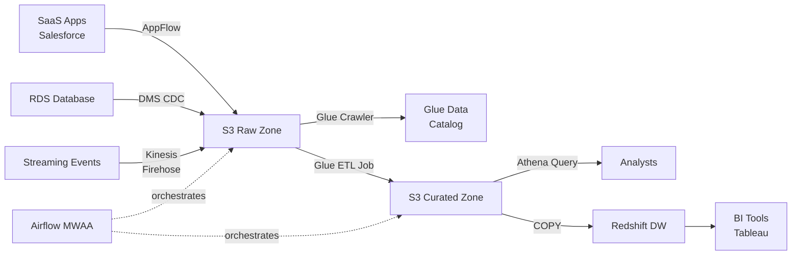
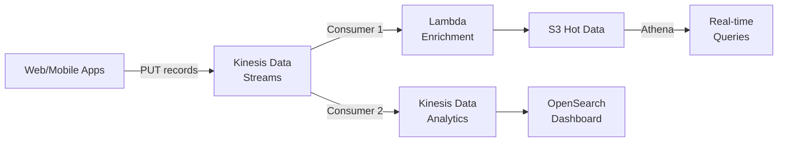
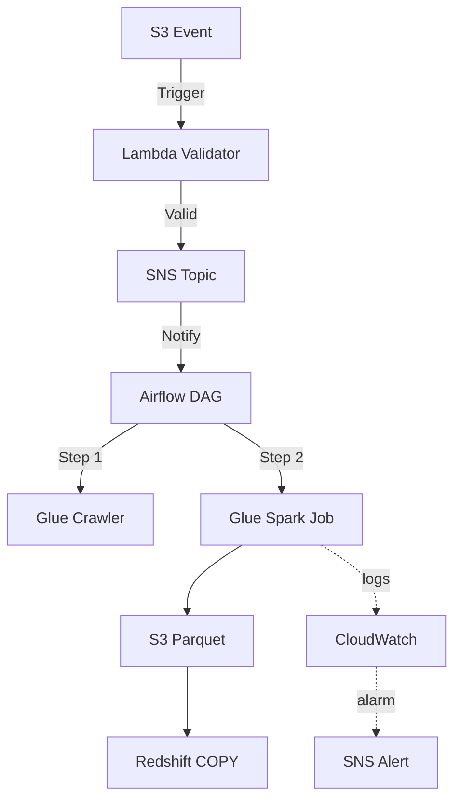

# Architecture Patterns 🏛️

[← Back to Main](../README.md)

Here are typical architectures you'll build using these services.

---

## Pattern 1: Modern Data Lake

**Use Case:** Centralized data repository from multiple sources

**Key Services:**
- S3 for storage
- DMS/AppFlow for ingestion
- Glue for ETL and cataloging
- Athena for ad-hoc queries
- Redshift for BI workloads

---

## Pattern 2: Real-time Analytics Pipeline

**Use Case:** Process and analyze streaming events in real-time

**Key Services:**
- Kinesis Data Streams for ingestion
- Lambda for transformation
- Kinesis Data Analytics for stream processing
- OpenSearch for dashboards

---

## Pattern 3: Batch ETL with Orchestration

**Use Case:** Automated daily batch processing with error handling

**Key Services:**
- S3 Events + Lambda for triggers
- Airflow for orchestration
- Glue for processing
- CloudWatch for monitoring

---

## Related Topics

- **[Advanced Architectures](15_advanced_architectures.md)**: Production patterns (multi-region, security)
- **[Daily Workflow](16_daily_workflow.md)**: How these patterns fit into daily operations
- **[Service Comparisons](12_service_comparisons.md)**: Choose the right services

[← Back to Main](../README.md)
