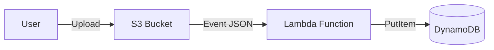

# Foundation Project 11: Event-Driven Compute (AWS Lambda)

## 🎯 Goal
Master **Serverless Compute**. We will write a Python function that automatically triggers whenever a file is uploaded to S3, parses the file's metadata, and logs it to a NoSQL database (DynamoDB).

## 🛑 The "Polling" Problem
*   **Old Way:** A server runs 24/7, checking S3 every minute: "Are there new files yet?" (Wasted compute).
*   **New Way (Event-Driven):** The server doesn't exist. When S3 receives a file, it "pokes" a Lambda function to wake up, run for 200ms, and shut down.

## 🛠️ The Solution: AWS Lambda
1.  **Trigger:** S3 Event Notification (`s3:ObjectCreated:*`).
2.  **Handler:** The Python function `lambda_handler(event, context)`.
3.  **Destination:** DynamoDB table (`file-metadata`).

## 🏗️ Architecture


## 🚀 How to Run (Simulation)
Since we are local, we simulate the S3 event.
1.  **Code:** `lambda_function.py` (The logic).
2.  **Event:** `test_event.json` (What S3 sends the function).
3.  **Run:**
    ```bash
    python lambda_function.py
    ```
