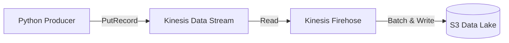

# Foundation Project 12: Native Streaming (Amazon Kinesis)

## 🎯 Goal
Master **AWS Native Streaming**. We will build a high-throughput producer that pushes clickstream data into a **Kinesis Data Stream**, which (conceptually) connects to a **Kinesis Firehose** to buffer data into S3.

## 🛑 The "Kafka Management" Problem
Kafka (Project 2) is powerful but operationally heavy. You have to manage Zookeeper, Brokers, Disk space, and upgrades.
*   **AWS Native Way:** **Kinesis** is "Serverless Kafka". You just provision "Shards" (throughput capacity) and AWS manages the infrastructure.

## 🛠️ The Solution: Amazon Kinesis
1.  **Data Stream:** The pipe that receives high-speed data (Real-time).
2.  **Firehose:** The delivery stream that automatically batches data and saves it to S3/Redshift (Near Real-time).
3.  **Analytics:** (Optional) SQL over the stream.

## 🏗️ Architecture


## 🚀 How to Run (Simulation)
1.  **Code:** `kinesis_producer.py` uses `boto3`.
2.  **Run:**
    ```bash
    python kinesis_producer.py
    ```
    *Note: This script mocks the AWS response if you don't have valid AWS credentials configured, ensuring you can test the logic locally.*
