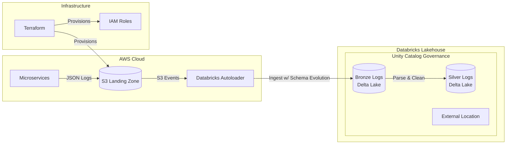

# Project 1: Serverless Application Log Ingestion

## 🚀 Project Overview
A production-grade ingestion pipeline for **High-Volume Application Logs**. We ingest semi-structured JSON logs (User Actions, System Events) from AWS S3 into a Databricks Lakehouse. It handles schema evolution automatically to support rapid application development cycles.

---

## 🛑 The Problem Structure
In a microservices architecture, centralized logging is critical but difficult to scale.

### 1. The "Small Files" Problem
**Context:** Ten thousand microservice instances emit logs every second. To avoid data loss, they flush to S3 frequently.
**The Pain:** This results in millions of tiny (2KB - 50KB) files landing in the bucket.
**Why it fails:** Traditional Spark jobs (`spark.read.json("s3://...")`) list the *entire* bucket to find new files. As the bucket grows to millions of files, the "Listing" operation takes longer than the "Processing" operation, eventually timing out.
**Necessity:** We need a system that detects *new* files via events (SQS/SNS) rather than directory listings.

### 2. Schema Evolution (The "Breaking Change")
**Context:** A developer pushes a hotfix adding a `debug_trace_id` field to the JSON logs.
**The Pain:** A standard ETL pipeline defined with a rigid schema (e.g., `id INT, message STRING`) crashes immediately upon encountering the new field.
**Why it fails:** Data Engineers are woken up at 3 AM to manually `ALTER TABLE` and backfill.
**Necessity:** We need "Schema-on-Write" that adapts automatically—adding new columns to the target table without stopping the pipeline.

### 3. Governance of "Dark Data"
**Context:** S3 buckets become data swamps. No one knows if `s3://logs/2023/` contains PII (Passwords, Emails).
**The Pain:** Compliance audits (GDPR/CCPA) fail because we cannot enumerate who has access to this data.
**Necessity:** We need to elevate files to **Tables** registered in a central Catalog (Unity Catalog) to enforce row/column-level security.

---

## 🛠️ The Solution Strategy
We implement a **Serverless Lakehouse** using Databricks Autoloader.

### Architecture Diagram

---

## 🏗️ Technology Stack & Justification

| Component | Technology | Why this choice? (The "Necessity") |
| :--- | :--- | :--- |
| **Ingestion** | **Databricks Autoloader** | **Scalable File Detection.** It uses a "Scalable File Notification" mode (using RocksDB under the hood) to track ingested files, avoiding S3 listing limitations. It enables `schemaEvolutionMode="addNewColumns"`. |
| **Storage** | **AWS S3** | **Decoupled Storage.** We separate compute (Databricks) from storage (S3) to allow independent scaling. |
| **Infrastructure** | **Terraform** | **Disaster Recovery.** If an intern deletes the S3 bucket configuration, we can restore the exact permissions model in seconds. |
| **Pipeline** | **Delta Live Tables** | **Observability.** DLT provides a visual graph of data flow and quality metrics (e.g., "5% of logs dropped due to missing timestamp"), which is invisible in standard Spark jobs. |

---

## 📋 Implementation Plan

### Phase 1: Infrastructure (Terraform)
Provision the S3 buckets (`landing-logs`, `bronze-logs`, `silver-logs`) and IAM Roles.

### Phase 2: Governance (Unity Catalog)
Register the buckets as **External Locations** and define the metadata schema (`app_logs`).

### Phase 3: Pipeline (PySpark/DLT)
Write the Autoloader stream with schema evolution enabled.

---

## 🎓 Key Learnings
1.  **Handling Semi-Structured Data:** JSON parsing at scale.
2.  **Schema Evolution:** How to manage changing data structures without downtime.
3.  **Event-Based Ingestion:** Moving away from "File Listing".
