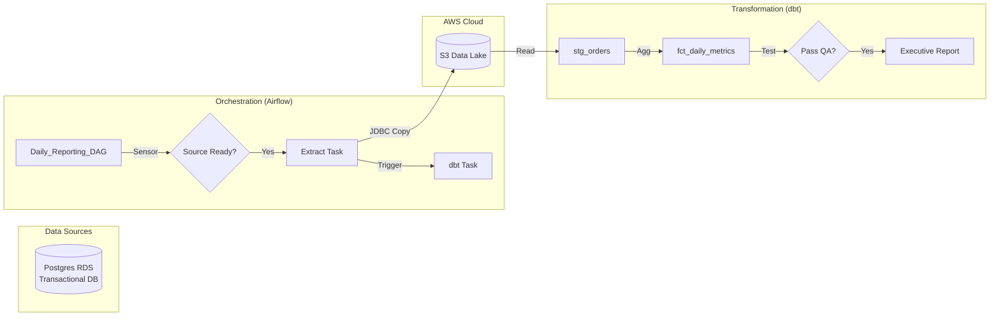

# Project 2: SLA-Driven Daily Reporting Pipeline

## 🚀 Project Overview
An orchestrated pipeline to generate **Mission Critical Daily Business Reports** (e.g., "Daily Active Users", "Total Revenue"). We extract transactional data from a Postgres database, transform it using dbt, and enforce strict delivery SLAs using Airflow.

---

## 🛑 The Problem Structure
Every company has a "Morning Report" that Executives read with their coffee. This report *must* be accurate and *must* be on time.

### 1. The "SLA" Problem (Time Sensitivity)
**Context:** The report must be in the CEO's inbox by 8:00 AM.
**The Pain:** Using a simple cron job (`0 7 * * *`) is fragile. If the source database is under maintenance until 7:05 AM, the cron job fails silently or processes partial data.
**Necessity:** We need a **Dependency-Aware Orchestrator** (Airflow) that uses "Sensors" to wait for upstream data availability and alerts engineers via PagerDuty if the 8:00 AM SLA is at risk.

### 2. The "Black Box" Logic Problem
**Context:** The definition of "Active User" changes (e.g., "Logged in" vs "Clicked a button").
**The Pain:** The logic is hidden in a 1000-line Stored Procedure or a proprietary Tableau calculation. When metrics look wrong, no one can trace the lineage or audit the code history.
**Necessity:** We need **Transformation-as-Code** (dbt). Logic lives in version-controlled SQL files (`git`). We can run `dbt docs generate` to see the exact lineage graph from Raw Table -> Aggregation -> Final Report.

### 3. The "Silent Failure" Data Quality Problem
**Context:** A frontend bug logs `revenue` as `-100.00`.
**The Pain:** A standard SQL pipeline sums this up happily. The report shows a massive drop in revenue. Executives panic.
**Necessity:** We need **Blocking Quality Gates**. We define tests (`assert_positive_revenue`) that run *before* the report is published. If the test fails, the pipeline halts, preventing bad data from reaching decision-makers.

---

## 🛠️ The Solution Strategy
We implement a **Modern Data Stack** (MDS) pattern.

### Architecture Diagram

---

## 🏗️ Technology Stack & Justification

| Component | Technology | Why this choice? (The "Necessity") |
| :--- | :--- | :--- |
| **Orchestration** | **Apache Airflow** | **SLA Enforcement.** It allows us to define `sla=timedelta(hours=2)` on tasks. If a task takes too long, it fires alerts. It supports "Backfilling" to re-process historical data systematically. |
| **Transformation** | **dbt (Data Build Tool)** | **Transparent Logic.** It separates "Extract/Load" (Airflow) from "Transform" (SQL). It enables software engineering best practices (Testing, CI/CD, Documentation) for SQL. |
| **Source System** | **AWS RDS (Postgres)** | **Realism.** Most business data lives in row-oriented OLTP databases. We need to handle the complexity of extracting from a system that is "live" and receiving writes. |

---

## 📋 Implementation Plan

### Phase 1: Infrastructure
Provision a Postgres RDS instance and S3 buckets.

### Phase 2: Orchestration (Airflow)
Write a DAG `daily_metrics_pipeline` that extracts data using the `PostgresOperator` or a Python connector.

### Phase 3: Transformation (dbt)
-   **Staging:** Cleanse raw table (Type casting).
-   **Fact:** Aggregate metrics (Sum revenue, Count users).
-   **Testing:** `dbt test` to ensure referential integrity and positive values.
