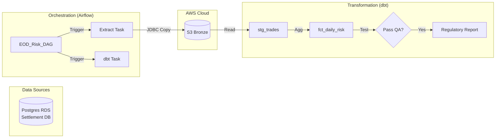

# Project 2: Regulatory Reporting Pipeline using dbt & Airflow (Finance Domain)

## 🚀 Project Overview
An orchestrated pipeline to generate **End-of-Day (EOD) Risk Reports** for a trading desk. We extract settled trades from a transactional database (Postgres), transform them into risk metrics using dbt, and enforce strict SLAs using Airflow.

---

## 🛑 The Problem (Finance Context)
1.  **Strict SLAs:** Regulators (e.g., FINRA, EMIR) require reports submitted by 6:00 PM. A delayed pipeline means massive fines.
2.  **Logic Transparency:** "Black Box" SQL scripts are unacceptable. Auditors need to see exactly *how* "Daily Exposure" is calculated (Lineage).
3.  **Data Quality:** Reporting incorrect exposure (e.g., negative calculated risk) triggers audits. We need blocking quality gates.

## 🛠️ The Solution Strategy
We implement a **Modern Data Stack** (MDS) pattern.

### Architecture Diagram

---

## 🏗️ Technology Stack & Justification

| Component | Technology | Why this choice? (The "Necessity") |
| :--- | :--- | :--- |
| **Orchestration** | **Apache Airflow** | **SLAs.** Native support for retries, SLA alerts, and dependency management (unlike Cron). Essential for "Must-Deliver" financial reports. |
| **Transformation** | **dbt (Data Build Tool)** | **Auditability.** Logic is version-controlled SQL. Auto-generated documentation and lineage graphs allow auditors to trace "Reported Risk" back to "Raw Trade". |
| **Source System** | **AWS RDS (Postgres)** | **Realism.** Trades settle in relational databases (OLTP). We need to verify we can handle JDBC extraction patterns. |
| **Quality** | **dbt Tests** | **Compliance.** `assert_positive_exposure`: If a test fails, the pipeline halts immediately, preventing bad reports from being sent to regulators. |

---

## 📋 Implementation Plan

### Phase 1: Infrastructure (Terraform)
-   Provision a strict **RDS Postgres** instance (simulating the upstream Settlement System).
-   Provision **S3 Buckets** for intermediate storage.

### Phase 2: Orchestration (Airflow)
-   Create a DAG `eod_risk_reporting`.
-   Task 1: `extract_trades_to_s3` (PythonOperator with PostgresHook).

### Phase 3: Transformation (dbt)
-   **Stage:** `stg_settled_trades` (Cast ISO dates, handle nulls).
-   **Fact:** `fct_counterparty_risk` (Sum `exposure` GROUP BY `counterparty`).
-   **Test:** Ensure no single counterparty exposure > $1M (Compliance Rule).

### Phase 4: Execution
-   Seed RDS with dummy settled trades.
-   Run DAG.
-   Simulate a "Bad Data" injection (Negative trade value) and watch dbt stop the pipeline.

---

## 🎓 Key Learnings
1.  **SLA Management:** Handling "Time-Sensitive" data.
2.  **Audit 101:** Using dbt lineage for compliance.
3.  **Dependency Management:** Airflow `sensors` vs `triggers`.
